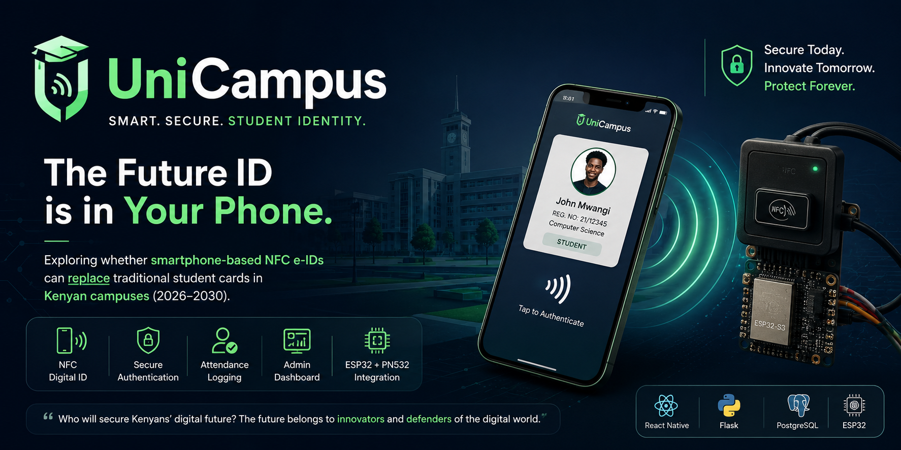
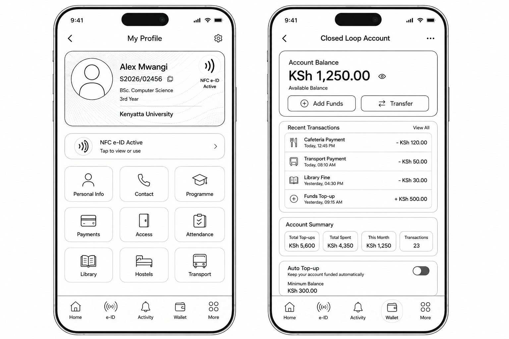
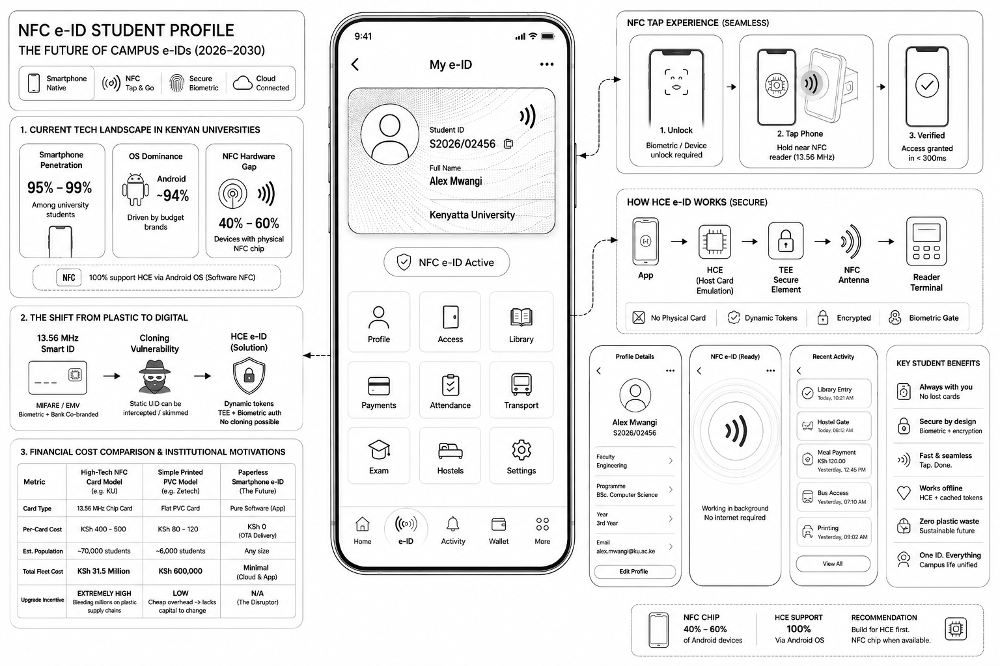
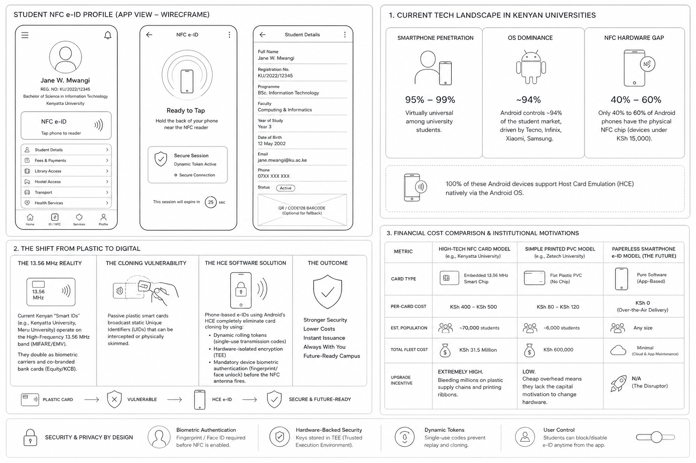

# UniCampus

> **Exploring whether smartphone-based NFC electronic student IDs can become the future of Kenyan campuses (2026–2030).**

<p align="center">
  
</p>

<p align="center">
  
  
  
  
</p>

---

# 📚 Table of Contents

- [UniCampus](#unicampus)
- [📚 Table of Contents](#-table-of-contents)
- [💡 The Vision](#-the-vision)
- [❓ Research Question](#-research-question)
- [🚨 Why This Matters](#-why-this-matters)
- [💡 The Proposed Solution](#-the-proposed-solution)
- [🎯 Project Objectives](#-project-objectives)
- [🛠 Technology Stack](#-technology-stack)
- [🏗 System Architecture](#-system-architecture)
- [🎨 Design Process](#-design-process)
- [📱 Project Showcase](#-project-showcase)
    - [System Overview](#system-overview)
    - [End-to-End Workflow](#end-to-end-workflow)
    - [Demonstration](#demonstration)
- [📂 Repository Structure](#-repository-structure)
- [⚙ Getting Started](#-getting-started)
  - [Clone Repository](#clone-repository)
  - [Mobile Application](#mobile-application)
  - [Backend](#backend)
  - [Firmware](#firmware)
- [📍 Current Development Status](#-current-development-status)
- [🗺 Development Roadmap](#-development-roadmap)
    - [Phase 1](#phase-1)
    - [Phase 2](#phase-2)
    - [Phase 3](#phase-3)
    - [Phase 4](#phase-4)
    - [Phase 5](#phase-5)
- [🔐 Security Considerations](#-security-considerations)
- [⚖ Engineering Decisions](#-engineering-decisions)
- [📖 Documentation](#-documentation)
- [🤝 Contributing](#-contributing)
- [📜 License](#-license)
- [🙏 Acknowledgements](#-acknowledgements)
  - [👨‍💻 About the Developer](#-about-the-developer)

---

# 💡 The Vision

UniCampus was born from a single question that stayed with me after attending a technology conference.

The speaker challenged the audience with a powerful question:

> **"Who will secure Kenya's digital future?"**

She ended with a statement that completely changed how I viewed technology.

> **"The future belongs to innovators who build and defend the digital world."**

Walking away from that conference, another question formed in my mind.

> **If smartphones have already replaced wallets, tickets, and bank cards... can they also replace traditional student identity cards in Kenyan universities?**

That question became UniCampus.

Rather than writing a research paper alone, I decided to engineer a complete working prototype combining mobile development, backend engineering, embedded systems, NFC communication, and secure authentication.

---

# ❓ Research Question

> **Can smartphone-based NFC electronic student IDs replace physical student identification cards in Kenyan universities between 2026 and 2030?**

UniCampus is an engineering research project investigating whether modern Android smartphones equipped with NFC can provide a secure, scalable, affordable and user-friendly alternative to traditional plastic student identification cards.

Rather than assuming the answer is "yes", this project aims to build, test and evaluate a real implementation.

---

# 🚨 Why This Matters

Most Kenyan universities still rely heavily on physical student identification cards.

These systems often suffer from challenges including:

* Lost or damaged student cards
* Expensive replacement processes
* Manual attendance verification
* Difficulty integrating with digital services
* Limited scalability for future smart campus initiatives
* Security concerns such as card sharing or duplication

As smartphones become increasingly common among university students, they present an opportunity to rethink how identity can be managed on campus.

---

# 💡 The Proposed Solution

UniCampus replaces physical student identification cards with secure smartphone-based NFC electronic IDs.

Using Android Host Card Emulation (HCE), a student's smartphone behaves like a secure NFC card.

When tapped against an ESP32-powered NFC reader, the system securely authenticates the student through a Flask backend before granting access or recording attendance.

The project combines:

* Mobile Application
* REST API
* Embedded Systems
* NFC Communication
* Secure Authentication
* Digital Identity

into a single integrated ecosystem.

---

# 🎯 Project Objectives

* Explore smartphone-based student identification systems
* Evaluate NFC as an alternative to physical student cards
* Design a secure authentication workflow
* Integrate embedded hardware with mobile applications
* Investigate secure storage using Android Trusted Execution Environment (TEE)
* Build a scalable architecture suitable for future smart campuses
* Document engineering decisions throughout development

---

# 🛠 Technology Stack

| Technology                  | Purpose                          |
| --------------------------- | -------------------------------- |
| React Native                | Android mobile application       |
| Flask                       | REST API backend                 |
| PostgreSQL / MySQL          | Database                         |
| ESP32-S3                    | Embedded NFC reader controller   |
| PN532                       | NFC communication module         |
| Android Host Card Emulation | Smartphone digital student ID    |
| Android Keystore / TEE      | Secure cryptographic key storage |
| Git & GitHub                | Version control                  |

> **Note:** The technology stack will continue evolving as research and development progress.

---

# 🏗 System Architecture

*(Architecture diagram will be added here.)*

```
Student Phone
        │
        ▼
 Android HCE
        │
        ▼
ESP32 + PN532 Reader
        │
        ▼
 Flask REST API
        │
        ▼
 Database
        │
        ▼
Admin Dashboard
```

---

# 🎨 Design Process

The project was designed before implementation.

Wireframing allowed the complete user journey, authentication flow and administrator interactions to be planned before writing code.

<!-- *(Insert Design Image #1 here.)* -->


---

# 📱 Project Showcase

### System Overview

<!-- *(Insert Image #2 here.)* -->


---

### End-to-End Workflow

<!-- *(Insert Image #3 here.)* -->


---

### Demonstration

A working demonstration video will be added as development progresses.

---

# 📂 Repository Structure

```
UniCampus/

│

├── mobile/          React Native Application

├── backend/         Flask API

├── firmware/        ESP32 Firmware

├── hardware/        Circuit Diagrams

├── docs/            Technical Documentation

├── assets/          Images & Media

└── README.md
```

---

# ⚙ Getting Started

## Clone Repository

```bash
git clone https://github.com/prim5v/ProjectUniCampus.git
```

## Mobile Application

```bash
cd mobile
npm install
```

## Backend

```bash
cd backend
pip install -r requirements.txt
```

## Firmware

```bash
cd firmware
```

Development instructions for ESP32 firmware will be added during implementation.

---

# 📍 Current Development Status

| Component            | Status         |
| -------------------- | -------------- |
| Research             | 🚧 In Progress  |
| System Design        | ✅ Completed    |
| UI Wireframes        | ✅ Completed    |
| Hardware Acquisition | ✅ Completed    |
| Mobile Development   | 🚧 In Progress |
| Backend Development  | 🚧 In Progress |
| Firmware Development | 🚧 In Progress |
| Hardware Integration | ⏳ Planned      |
| Field Testing        | ⏳ Planned      |

---

# 🗺 Development Roadmap

### Phase 1

* Research
* Literature Review
* Wireframes
* Architecture Design

### Phase 2

* Mobile Application
* Backend API
* Authentication

### Phase 3

* ESP32 Firmware
* PN532 Integration
* NFC Communication

### Phase 4

* Security
* Cryptography
* Performance Testing

### Phase 5

* Campus Evaluation
* User Testing
* Documentation
* Final Research Findings

---

# 🔐 Security Considerations

Security is a fundamental aspect of UniCampus.

Current research areas include:

* Secure NFC communication
* Android Host Card Emulation
* Trusted Execution Environment (TEE)
* Android Keystore
* Digital signatures
* Authentication tokens
* Replay attack prevention
* Secure backend validation

These mechanisms will continue evolving throughout development.

---

# ⚖ Engineering Decisions

Every major technology choice in UniCampus is backed by engineering reasoning rather than popularity.

Future documentation will explain decisions such as:

* Why NFC instead of QR codes?
* Why React Native instead of Flutter?
* Why Flask instead of Node.js?
* Why ESP32-S3?
* Why PN532?
* Why Host Card Emulation?
* Why Trusted Execution Environment?
* Why PostgreSQL or MySQL?

Understanding *why* technologies are selected is just as important as knowing *how* they work.

---

# 📖 Documentation

As the project grows, detailed documentation will be available in the `/docs` directory.

Planned documentation includes:

```
docs/

architecture.md

research.md

hardware.md

security.md

api.md

roadmap.md

engineering-journal.md
```

---

# 🤝 Contributing

Although UniCampus is currently a personal engineering and research project, suggestions, discussions and constructive feedback are always welcome.

---

# 📜 License

This project will be released under the MIT License.

---

# 🙏 Acknowledgements

Special thanks to the technology conference that inspired the original research question:

> **"Who will secure Kenya's digital future?"**

That single question inspired the creation of UniCampus.

This project also builds upon the incredible work of the open-source communities behind React Native, Flask, ESP32, Android NFC technologies and countless educational resources that continue to empower student developers around the world.

---

## 👨‍💻 About the Developer

**Preem5v**

Second-Year Software Engineering Student

Aspiring Embedded Systems & Full-Stack Engineer

Building technology that explores the future of secure digital identity.

> *"The future isn't something we wait for—it's something we engineer."*
